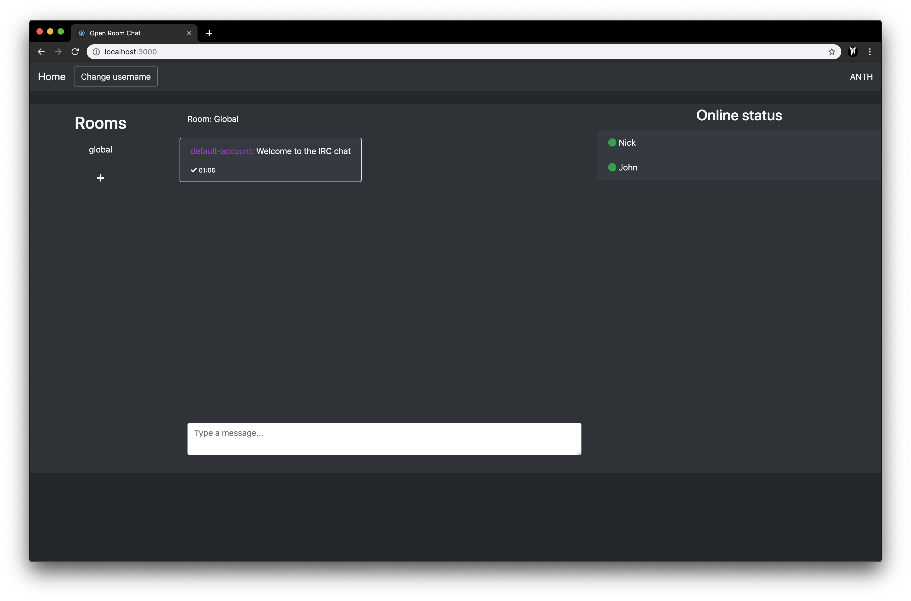

## Open room chat
Open room chat is an open source self-hosted stateless room chat using mqtt for message transport.



## Requirements
- Node v11.12.0+
- npm v6.7.0+
- git


## Clone

```
cd your-folder
git clone https://github.com/damienzonly/Open-Room-Chat.git .
```

## Install and configure
Run the install script and edit the parameters in the .env file

```
./install.sh
```

## Run the development server

```
npm start
```

If using internal broker:

```
node broker
```

## Testing discovery connections

The online status sidebar shows the list of connected users, the provided `fake-users.js` script will fake a certain amount of user connections.

```
node fake-users
```
